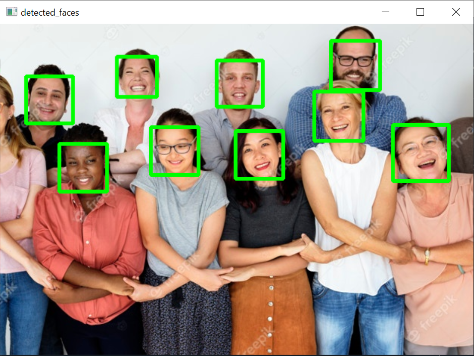

# A-Real-Time-Face-Detection-Using-OpenCV
OpenCV library in Python was used to develop a real time face detection code. The real time face detection code was tested using the same code but with a picture as an input. Also, the classifier used to detect the faces (haarcascade_frontalface_default.xml) was obtained from https://github.com/opencv/opencv/tree/master/data. 

## The Real Time Face Detection
  1. Download a Python IDE (Anaconda-Spyder was used).
  2. Install OpenCV by opening Anaconda prompt and enter the following command:
  ```
  pip install opencv-python
  ```
  3. Save the included files in the repository (ALL IN ONE LOCATION!).
  4. Open (Real_Time_Face_Detection.py) in spyder.
  5. Run the code.
  6. The computer camera should open and detect the faces in front of it.
  7. Click 'Esc' button to stop.

## The Picture Face Detection Used For Testing
  1. Open (Picture_Face_Detection.py) in spyder.
  2. Run the code.
  3. The following image should be produced:
  


